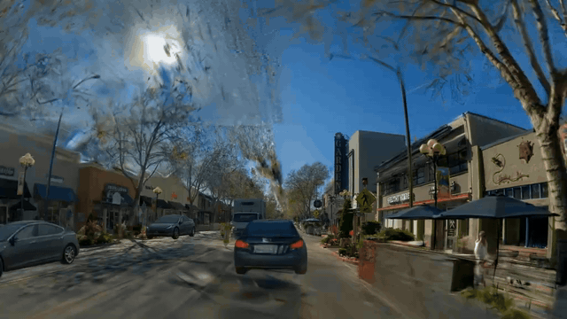

# Harmonizer

**Harmonizer: Bridging Neural Reconstruction and Photorealistic Simulation with Online Diffusion Enhancer**  
[Yuxuan Zhang*](https://research.nvidia.com/labs/sil/), [Katarína Tóthová*](https://research.nvidia.com/labs/sil/), [Zian Wang](https://www.cs.toronto.edu/~zianwang/), [Kangxue Yin](https://kangxue.org/), [Haithem Turki](https://haithemturki.com/),  
[Riccardo de Lutio](https://riccardodelutio.github.io/), [Yen-Yu Chang](https://yenyuchang.github.io/), [Or Litany](https://orlitany.github.io/), [Sanja Fidler](https://www.cs.utoronto.ca/~fidler/), [Zan Gojcic](https://zgojcic.github.io/) _(* equal contribution)_  
CVPR 2026  
[Project Page](https://research.nvidia.com/labs/sil/projects/diffusion-harmonizer/) | [Paper](https://arxiv.org/abs/2602.24096)

NVIDIA Harmonizer is an online generative enhancement framework built on NVIDIA Cosmos that improves NVIDIA Omniverse NuRec renderings. It corrects novel-view artifacts, lighting, and shadow, and re-harmonizes inserted assets into reconstructed scenes for autonomous vehicle and robotics simulation.

<p align="center">
  
</p>

## About

Simulation is essential to the development and evaluation of autonomous robots such as self-driving vehicles. Neural reconstruction methods (e.g. NeRF, 3D Gaussian Splatting) are a promising way to build simulators from real-world data, but reconstructed scenes often contain artifacts in novel views and struggle to realistically incorporate inserted dynamic objects from different scenes.

**Harmonizer** is an online generative enhancement framework that transforms renderings from such imperfect scenes into temporally consistent outputs while improving their realism. It distills a pretrained multi-step diffusion model into a single-step, temporally-conditioned enhancer that runs on a single GPU inside online simulators. A specialized data-curation pipeline produces synthetic-real training pairs that target three failure modes: appearance harmonization, artifact correction, and lighting realism.

<p align="center">
  
</p>

## Setup

- **Environment**:
  - We use `nvcr.io/nvidia/pytorch:25.10-py3` as the base environment for training and inference with the pretrained model.

- **Build Docker Image**:
  ```sh
  # For training and standard inference
  docker build -t harmonizer-cosmos-env -f Dockerfile.cosmos .
  ```

- **Format Code**:
  ```sh
  uvx ruff format
  uvx ruff check --fix
  ```

## Download Pretrained Checkpoint

Pretrained Harmonizer checkpoints are hosted on [nvidia/Harmonizer](https://huggingface.co/nvidia/Harmonizer). Inference also requires the base [Cosmos-Predict2-0.6B-Text2Image](https://huggingface.co/nvidia/Cosmos-Predict2-0.6B-Text2Image) model. The `download_checkpoints.sh` helper fetches everything and places it in the directories the code expects:

```sh
# Install Hugging Face CLI if not already installed
pip install huggingface_hub[cli]

# Login to Hugging Face
hf auth login

# Download all required checkpoints (Harmonizer + base Cosmos model)
./download_checkpoints.sh
```

This places the Harmonizer checkpoints in `models/` (`diffusion_harmonizer.pkl`, `harmonizer_nontemporal.pt`) and the base Cosmos-Predict2-0.6B-Text2Image model (DiT `model.pt` + tokenizer) in `src/checkpoints/nvidia/Cosmos-Predict2-0.6B-Text2Image/`.

## Inference

### 1. Inference with the pretrained model (temporal)

Use `inference_pix2pix_turbo_harmonizer.py` with the `diffusion_harmonizer.pkl` (paper checkpoint):

```bash
# Run the Cosmos container:
docker run --gpus=all -it --ipc=host \
  -v $(pwd):/work \
  harmonizer-cosmos-env

# Inside the container, run inference (the script lives in src/ and imports sibling modules):
cd /work/src
python inference_pix2pix_turbo_harmonizer.py \
    --input_image  /work/examples \
    --model_path /work/models/diffusion_harmonizer.pkl \
    --model_identifier "harmonizer_inference" \
    --timestep 250 --resolution 1024 --use_sched;
```

## Download Training Data

The Harmonizer training set is composed of synthetic–real image pairs from five data sources, each targeting a specific failure mode of neural-reconstruction renderings. The full assembled dataset is available on [Hugging Face](https://huggingface.co/datasets/nvidia/Harmonizer-Dataset):

```sh
hf download nvidia/Harmonizer-Dataset --repo-type dataset --local-dir data
```

The downloaded dataset is organized in the paired-directory layout described in [Data Preparation](#1-data-preparation).

### Data sources and curation pipelines

The training set combines five complementary data sources, each targeting a specific failure mode of neural-reconstruction renderings. The summary table below lists the failure mode and where to find the curation tooling for each source. Detailed pair-construction recipes follow.

| Data source            | Failure mode targeted                                                                         | Curation codebase                                                                                                                                                  |
| ---------------------- | --------------------------------------------------------------------------------------------- | ------------------------------------------------------------------------------------------------------------------------------------------------------------------ |
| ISP Modification       | ISP-induced color / tone drift between foreground and background                              | [`scripts/data_curation/isp_modification.py`](./scripts/data_curation/isp_modification.py) *(placeholder — script will be added to this repo)*                     |
| Relighting             | Illumination mismatch between inserted objects and scene lighting                             | [DiffusionRenderer](https://research.nvidia.com/labs/toronto-ai/DiffusionRenderer/)                                                                                |
| Asset Re-insertion     | Missing shadows / appearance mismatch when dynamic assets are re-inserted                     | [Asset Harvester](https://github.com/nvidia/asset-harvester/)                                                                                                      |
| PBR Shadow Simulation  | Missing or unrealistic cast shadows on inserted objects                                       | Internal CG-based simulation pipeline; simulated dataset open-sourced on Hugging Face *(placeholder link — TBD)*                                                   |
| Artifacts Correction   | Novel-view rendering artifacts: blurred details, missing regions, ghosting, spurious geometry | [Difix3D+](https://github.com/nv-tlabs/Difix3D)                                                                                                                    |

#### Per-source curation recipes

- **ISP Modification.** Targets ISP-induced color and tone inconsistencies between foreground and background. Given a real capture, we segment the foreground with [SAM 2](https://github.com/facebookresearch/sam2) and re-render the masked region through a software ISP with randomized tone mapping, exposure, and white balance; the unmodified capture serves as the target. Curation script: [`scripts/data_curation/isp_modification.py`](./scripts/data_curation/isp_modification.py) *(placeholder — script will be added to this repo)*.

- **Relighting.** Targets illumination mismatch between inserted objects and the surrounding scene. We use [DiffusionRenderer](https://research.nvidia.com/labs/toronto-ai/DiffusionRenderer/) to regenerate selected foreground regions under randomly sampled lighting conditions while preserving geometry and texture; the original capture (with scene-consistent lighting) is the target. Follow the instructions on the DiffusionRenderer project page to reproduce the relighting pairs.

- **Asset Re-insertion.** Targets missing shadows and appearance mismatch when reconstructed dynamic assets are dropped into a static background. We reconstruct the static background with [3DGUT](https://research.nvidia.com/labs/toronto-ai/3dgut/), harvest foreground 3D assets with [Asset Harvester](https://github.com/nvidia/asset-harvester/), and re-insert them into the reconstructed scene **without** casting shadows. The original captured sequence — which contains correct shadows and coherent appearance — is the target.

- **PBR Shadow Simulation.** Targets missing or unrealistic cast shadows on inserted objects. A physically-based renderer synthesizes paired frames *with* and *without* cast shadows under controllable light configurations; environment maps are randomized to vary light direction, softness, and intensity. The simulated dataset is open-sourced on Hugging Face: *(placeholder link — TBD)*.

- **Artifacts Correction.** Targets novel-view synthesis artifacts (blurred details, missing regions, ghosting, spurious geometry). Following the strategy from [Difix3D+](https://github.com/nv-tlabs/Difix3D), degraded frames are produced through four procedures — sparse reconstruction, cycle reconstruction, cross-referencing, and deliberate model underfitting — and paired with the corresponding clean rendering as the target.

## Training

### 1. Data Preparation

The released dataset unpacks into the following paired-directory layout:

```
data/
├── train_A/
├── train_B/
├── train_prompts.json
├── test_A/
├── test_B/
└── test_prompts.json
```

Set `DATASET_FOLDER` to the unpacked dataset root. To regenerate or extend any individual data source, see the per-source curation codebases linked above. The general procedure to generate training image pairs using NuRec can also be found in the [dataset preparation tutorial](./doc/dataset_preparation_tutorial.md).

### 2. Multiple GPU Training Command

```bash
export NUM_NODES=1
export NUM_GPUS=8
export OUTPUT_DIR="/path/to/checkpointing_directory"
export DATASET_FOLDER="/data/data.json" # Set to your data path
export WANDB_MODE=offline

accelerate launch --mixed_precision=bf16 --main_process_port 29501 --multi_gpu --num_machines $NUM_NODES --num_processes $NUM_GPUS src/train_pix2pix_turbo_harmonizer.py \
    --output_dir=${OUTPUT_DIR} \
    --dataset_folder=${DATASET_FOLDER} \
    --max_train_steps 10000 \
    --learning_rate 2e-5 \
    --train_batch_size=1 --gradient_accumulation_steps 1 --dataloader_num_workers 8 \
    --checkpointing_steps=2000 --eval_freq 1000 --viz_freq 1000 \
    --train_image_prep "resize_576x1024" --test_image_prep "resize_576x1024" \
    --lambda_clipsim 0.0 --lambda_lpips 0.3 --lambda_gan 0.0 --lambda_l2 1.0 --lambda_gram 0.0 \
    --use_sched --report_to "wandb" --tracker_project_name "cosmos_harmonizer" --tracker_run_name "train" --train_full_unet --timestep 250 --track_val_fid --num_samples_eval 20 --mixed_precision=bf16
```

**Resume training:** add `--resume ${OUTPUT_DIR}/checkpoints` if you want to resume the model training.

**Best practice:** We set the hyperparameters from our best practice explicitly in the command above. Specifically, we used a learning rate of `2e-5`, timesteps of `250`, on resolution of `576×1024`, and a perceptual loss weight of `0.3`, etc. We encourage users to start training with these defaults parameters first and adjust them to their dataset as needed. When training on the released dataset, we further recommend adding `--fixing_data_weight 3` to up-weight the fixing data source in the weighted sampler, which we have found yields noticeably better quality.

### Finetuning from a pretrained Harmonizer

Include the flag `--pretrained_path /path/to/diffusion_harmonizer.pkl` to initialize training from the pretrained Harmonizer checkpoint; when omitted, the model will be finetuned directly from the raw Cosmos 0.6B image model.

## Support

**Usage questions and discussion:** please post on the
[NVIDIA Developer Forum (Omniverse / NuRec)](https://forums.developer.nvidia.com/c/omniverse/platform/nurec/752).

**Code-level bugs, documentation issues, and feature requests:** file a
[GitHub issue](../../issues/new/choose) using the appropriate template. The
relevant NVIDIA responder is assigned automatically.

**Security vulnerabilities:** use
[NVIDIA's Vulnerability Disclosure Program](https://app.intigriti.com/programs/nvidia/nvidiavdp/detail).
Do not file security issues publicly in this repository.

## Citation

```bibtex
@article{zhang2026diffusionharmonizer,
  title   = {DiffusionHarmonizer: Bridging Neural Reconstruction and Photorealistic Simulation with Online Diffusion Enhancer},
  author  = {Zhang, Yuxuan and T{\'o}thov{\'a}, Katar{\'\i}na and Wang, Zian and Yin, Kangxue and Turki, Haithem and de Lutio, Riccardo and Chang, Yen-Yu and Litany, Or and Fidler, Sanja and Gojcic, Zan},
  journal = {arXiv preprint arXiv:2602.24096},
  year    = {2026}
}
```

Harmonizer builds on the single-step image diffusion paradigm introduced by [Difix3D+](https://github.com/nv-tlabs/Difix3D) ([paper](https://arxiv.org/abs/2503.01774)).
