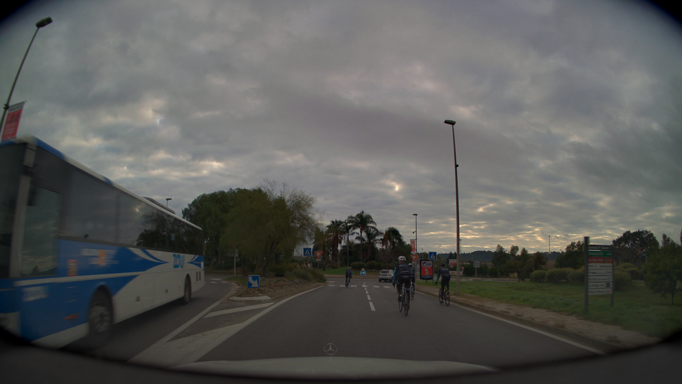
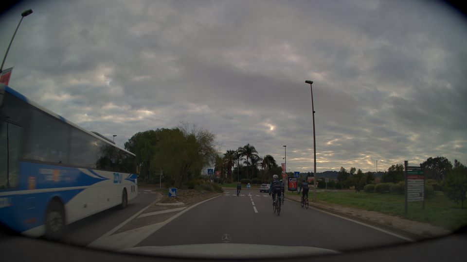
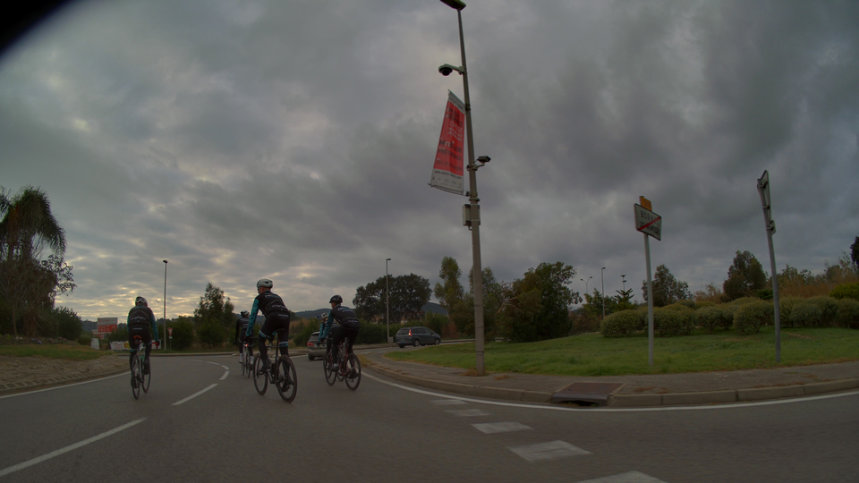
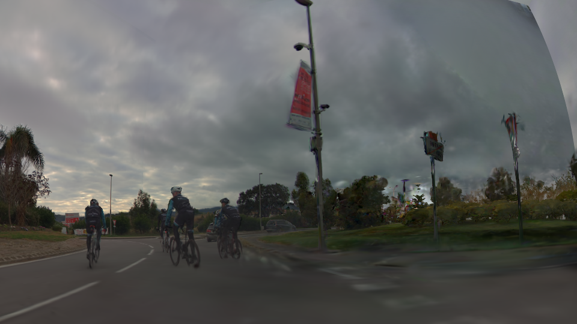

# Harmonizer training dataset preparation tutorial

There are four different methods to generate image pair for training the Harmonizer model:

- Sparse reconstruction
- Cycle reconstruction
- Model underfitting
- Cross reference

In this tutorial, we will walk through the steps for sprase reconstruction, model underfitting and cross reference based on NuRec.

## Sparse reconstruction

To train a 3D representation with every nth frame and pair the remaining ground truth images with the rendered “novel” views.

### Sample command

```shell
docker run -it --rm --gpus all  --shm-size=32gb  -v /host/path/to/data:/container/path/to/data nvcr.io/nvidia/nre/nre-enterprise:25.11 --config-name=configs/apps/prod/Hyperion-8.1/car2sim.yaml mode=trainval out_dir=/output/path/sparse \
dataset.path=/path/to/data.json \
dataset.camera_ids=[camera_front_wide_120fov] dataset.lidar_ids=[lidar_gt_top_p128] logger=wandb logger.offline=true \
dataset.n_samples_per_epoch=10000 \
dataset.samplers.batch_sampler.camera_frame_sampler.name="holdout" \
+dataset.samplers.batch_sampler.camera_frame_sampler.include_every_n_frames=30 \
dataset.samplers.batch_sampler.lidar_frame_sampler.name="holdout" \
+dataset.samplers.batch_sampler.lidar_frame_sampler.include_every_n_frames=1 \
dataset.val_camera_exclude_frame_step=30 \
dataset.val_camera_frame_step=null \
dataset.val_camera_exclude_frame_start=0 \
loss.lidar.lambda_=0.0 \
loss.background.lambda_=0.0 \
loss.background_lidar.lambda_=0.0
```
### Visualization
|Ground truth|Reconstruction|
|---|---|
|||


## Model underfitting
underfit our reconstruction by training it with a reduced number of iterations (25%-75% of the original training schedule).
### Sample command
```shell
docker run -it --rm --gpus all  --shm-size=32gb  -v /host/path/to/data:/container/path/to/data nvcr.io/nvidia/nre/nre-enterprise:25.11 --config-name=configs/apps/prod/Hyperion-8.1/car2sim.yaml mode=trainval out_dir=/output/path/underfitting \
dataset.path=/path/to/data.json \
dataset.camera_ids=[camera_front_wide_120fov] dataset.lidar_ids=[lidar_gt_top_p128] logger=wandb logger.offline=true \
dataset.n_samples_per_epoch=2500
```
### Visualization
|Ground truth|Reconstruction|
|---|---|
|||

## Cross reference
train the reconstruction model solely with one camera and render images from the remaining held out cameras.
### Sample command
```shell
docker run -it --rm --gpus all  --shm-size=32gb  -v /host/path/to/data:/container/path/to/data nvcr.io/nvidia/nre/nre-enterprise:25.11 --config-name=configs/apps/prod/Hyperion-8.1/car2sim.yaml mode=trainval out_dir=/output/path/cross_reference \
dataset.path=/path/to/data.json \
dataset.camera_ids=[camera_front_wide_120fov,camera_cross_left_120fov,camera_cross_right_120fov] \
dataset.lidar_ids=[lidar_gt_top_p128] logger=wandb logger.offline=true \
dataset.train_camera_ids=[camera_front_wide_120fov] \
dataset.val_camera_ids=[camera_cross_left_120fov,camera_cross_right_120fov] \
dataset.n_samples_per_epoch=10000
```
### Visualization
|Ground truth|Reconstruction|
|---|---|
|||
